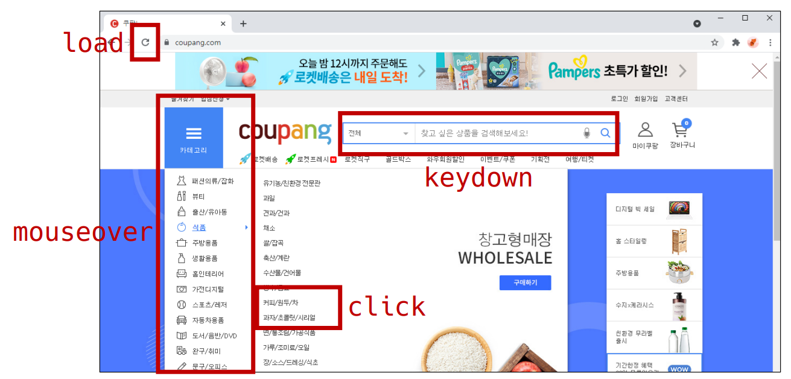
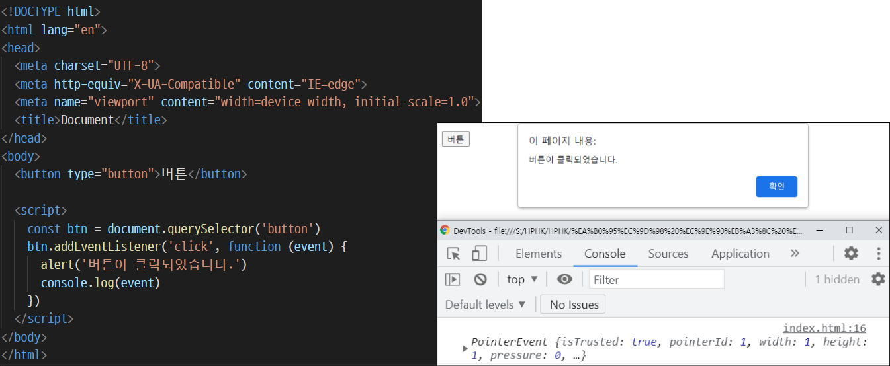

# Event

---

---

---

# Event

## Event 개념

- 네트워크 활동이나 사용자와의 상호작용 같은 사건의 발생을 알리기 위한 객체
- 이벤트 발생
  - 마우스를 클릭하거나 키보드를 누르는 등 사용자 행동으로 발생할 수도 있음
  - 특정 메서드를 호출( Element.click() )하여 프로그래밍적으로도 만들어 낼 수 있음

 

## Event의 역할 

- \~~~ 하면   \~~~ 한다.
- 클릭**'하면'**, 경고창을 **'한다'.**
- 특정 이벤트가 발생**'하면'** 할 일(함수)을 등록**'한다'.**

## Event handler - addEventListener()

- EventTarget.addEventListener()
  - 지정한 이벤트가 대상에 전달될 때마다 호출할 함수를 설정
  - 이벤트를 지원하는 모든 객체(Element, Document, Window 등)를 대상으로 지정 가능

- target.addEventListener(type, listener[, options] )

  - type
    - 반응 할 이벤트 유형(대소문자 구분 문자열)

  - listener
    - 지정된 타입의 이벤트가 발생했을 때 알림을 받는 객체
    - EventListener 인터페이스 혹은 JS function 객체(콜백 함수) 여야 함

- EventTarget.addEventListener(type, listener)

  ​              대상.                   (특정 이벤트,  할일)

- 대상에 특정 이벤트가 발생하면, 할 일을 등록하자

## addEventListener 실습

